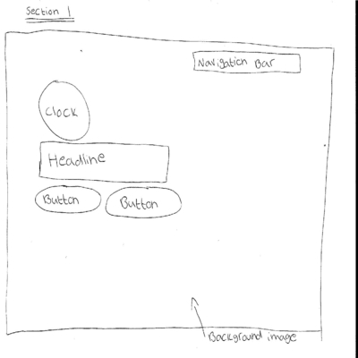
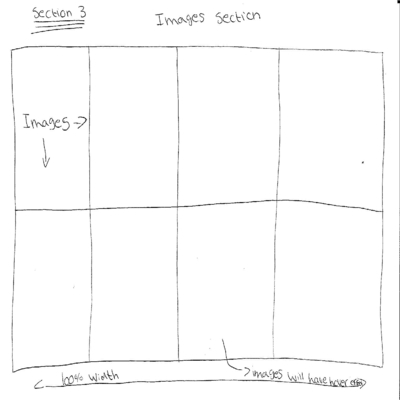

# CTEC3905-Website 
## Contributers: Kasim Butt -P15185180

### Website Background

My Website will be based on the city of Leicester. The Website has been created for the purpose of the public to see what Leicester has to offer and the famous places which are based there. The website is used to engage tourists and help them in a way to find out the diffrent activites there are in Leicester and help there way to get around. They will be able to asked questions through a form and see several pictures of Leicester. The website will be created as a single Application Website, the whole website will be based on one page, the user will find it more easier to find all the information needed on one page. 

#### Technology used 
- HTML5 was used for the page layout.
- CSS used to style the webpage.
- JavaScript used to add scroll, map and clock.

##### Navigational Structure 

